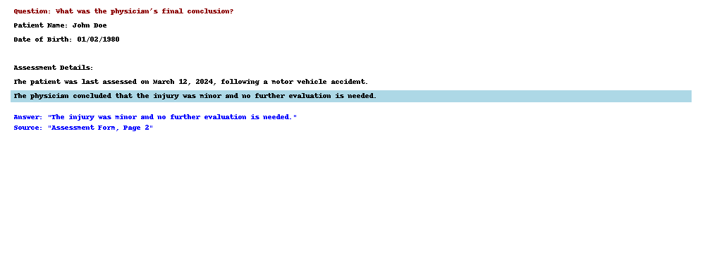
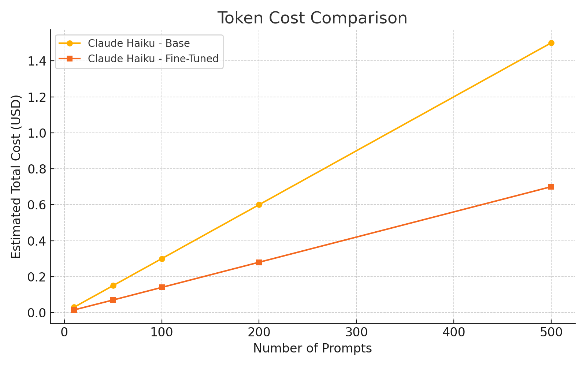
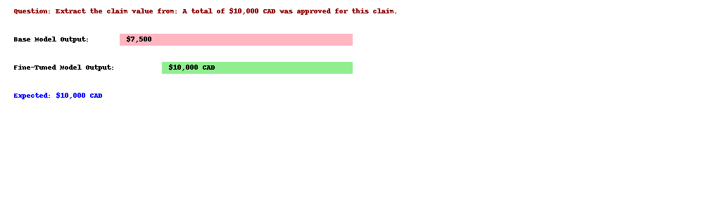
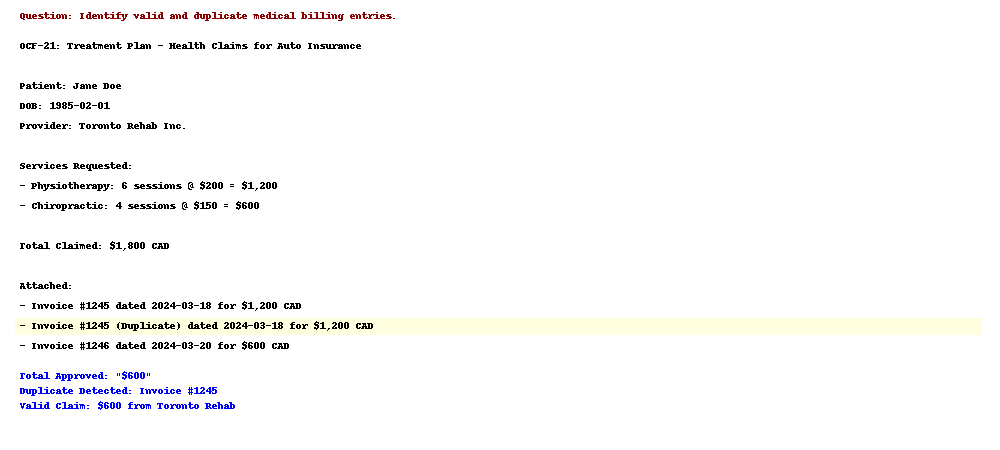
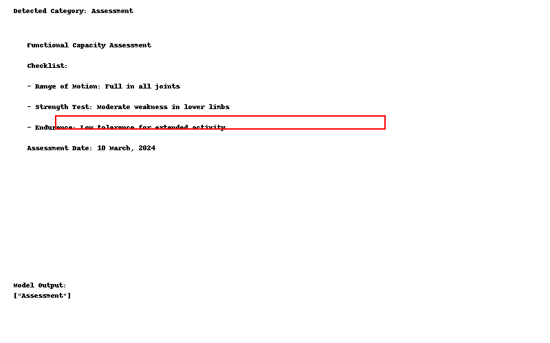
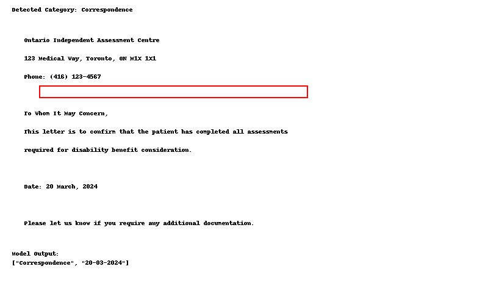
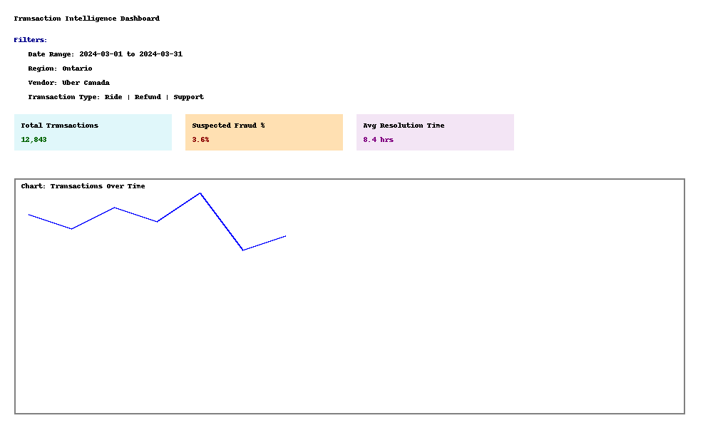
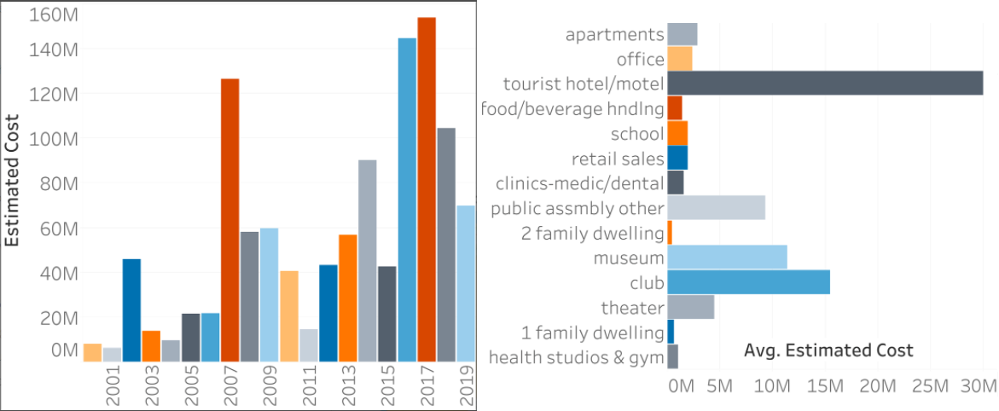
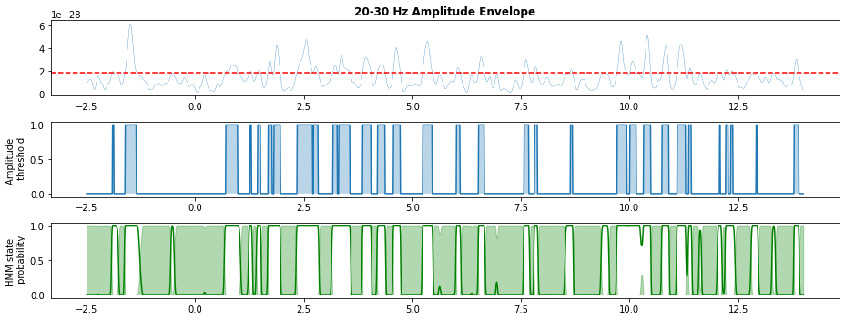

# Portfolio

---

## Natural language processing (NLP)

### Multimodal QnA System for Personal Injury Case Data (AWS Bedrock + Claude Sonnet 3)

 This project simulates a multimodal Question Answering system for legal and medical documents — designed for workflows such as personal injury cases, disability assessments, and insurance claims. It demonstrates: Claude Sonnet QnA via AWS Bedrock, Retrieval-Augmented Generation (RAG), Prompt templating and structured outputs, Multimodal inputs (text + image). 

  
 

 

--- 
### Fine-tuning LLMs with AWS Claude Haiku

 This project simulates the fine-tuning of AWS Claude Haiku for domain-specific tasks like structured information extraction and Q&A.

🔧 Features
📦 Converts training data into Claude-compatible JSONL format
🎯 Simulates fine-tuning on custom tasks
📊 Evaluates performance with basic metrics
🧠 Shows output differences before and after fine-tuning. 

  
 

 

--- 
### Insurance Claim Auditor – Medical Timeline & Fraud Detection with LLMs

 This project simulates an advanced LLM-based pipeline for insurance claim analysis, specifically targeting Ontario Claim Forms (OCFs), medical invoices, and duplicate billing detection. The system combines fast inference with Hugging Face Phi-3.5 and structured JSON generation using fine-tuned LLaMA, and is deployable to Amazon SageMaker.
  
🔧 Features: Extracts chronological medical events from unstructured documents
Parses OCF-21, OCF-18 and OCF-23 forms to extract claimed amounts
Identifies invoices and maps them to treatment categories
Detects duplicate or overlapping billings for fraud prevention
Outputs standardized JSON for downstream audit tools 

  
 

 

--- 
### Intelligent Prompt Routing Engine using AWS Textract Layout for LLM Preprocessing

 This project simulates an intelligent routing engine that automatically directs various document types (e.g., forms, reports, assessments, correspondence) to appropriate LLM prompt templates. Inspired by real-world enterprise applications, it uses mocked Textract outputs and a simple rule engine to demonstrate the concept. 

  
 

 

--- 

### Tweet Emotion Recognition with TensorFlow

 This is a multi class classification problem using a tweet emotion dataset to learn to recognize 6 different emotions ('sadness, 'surprise', 'love', 'anger', 'fear', 'joy) in tweets. A tokenizer is implemented in Tensorflow to perform padding and truncating sequences from tweets. The deep learning model includes Bidirectional long-short term memory(Bidirectional LSTM) and is also implemented in TensorFlow. 

  
 

 

--- 
## Big Data & Distributed Systems

### Scalable Text & Transaction Intelligence System (spaCy + AWS Quicksight)

 In this project, I built a non-LLM analytics pipeline that transforms raw documents and transactional records into structured insights, enabling fraud detection, forecasting, classification, and real-time monitoring. Designed for scalable environments like rideshare, e-commerce, and financial operations. 🔧 Features: Extracts key fields (dates, prices, vendors) from receipts, logs, contracts
📍 Named entity recognition (NER) for org names, locations, references
📂 ML-based document classification: SVM, logistic regression
📈 Statistical forecasting (ARIMA, Holt-Winters) for tickets & transactions.
 

 
  
---
## Exploratory Data Analysis

### Geocoding and Analyzing San Francisco Building Permit Data (Jan 2021)

 In this project, I explored and analyzed more than seven years of the City of San Francisco's building permit data and used the API OpenStreetMap to find the geo coordinates of buildings. After creating a new clean dataset that includes geo coordinates, I used Tableau to visualize and analyze the dataset. 

 

 

---
### Hyper Parameter Optimization in Artificial Neural Network (ANN) using MNIST Data from sklearn (Jan 2021)

 In this project, I implemented different hyperparameter tuning methods (e.g. Grid search, Random search, Hyperband, Bayesian Optimization with Gaussian Processes (BO-GP)) to achieve the optimized set of hyperparameters for the ANN architecture. 

  
---
## Time Series Analysis

### Stock Price Prediction of Apple Inc. Using Recurrent Neural Network (Dec 2021)

 The project is about prediction of stock price using deep learning. The dataset consists of Open, High, Low and Closing Prices of Apple Inc. stocks from 3rd january 2011 to 13th August 2021. Two sequential LSTM layers have been combined together and a dense layer is used to build the RNN model using Keras deep learning library. Since this is a regression task, 'linear' activation has been used in final layer. 

 

 
  
---
### Deep Convolutional Model to Study Brain-stimulation Induced Features from Human EEG Data (May - Aug 2019)

 In this project, I built a Convolutional Neural network-based framework in PyTorch to identify brain stimulation-induced EEG features. EEG data were collected from 30 subjects with 5 different conditions: sham/20Hz/70Hz/individual β/individual γ tACS brain stimulation. [Ref: "Deep Semantic Architecture with discriminative feature visualization for neuroimage analysis", Ghosh A. et al. 2018.

 

 

---
### Software-hardware Interface for Synchronization of EEG and Force sensor Devices (May - Aug 2019)

In this project, I designed the software-hardware interface to synchronize the EEG device with the force sensor and also developed experimental tasks to study motor learning characteristics.

 

 
  

---
### Predict Transient Spikes in Time Series Data using Time-delay Embedded (TDE) Hidden Markov Model (Sep 2020 - Present)

As part of my Master’s project, I designed a Time-Delay Embedded (TDE) Hidden Markov model to detect transient bursts from the beta frequency range (13 - 30 Hz) of MEG signal. In this study, I have used morlet wavelet transform to extract beta oscillatory envelopes from the raw MEG signal. Also, I am currently developing a Machine learning (ML) pipeline to classify MEG/EEG signal into ’burst’ states in real-time and the results will be further used to design a closed-loop neurofeedback system.

 

 

 
  
  
---
### Supervised-learning-based Classification of EEG Signals to Predict Mental States (May - Jun 2018)

 This project is about mental state classification of human subjects using single channel EEG data. EEG data from 5 subjects were collected during a horror movie, a comedy movie clip and during a mental task. In this study, I have used different supervised machine learning algorithms (such as KNN, SVM, LDA) and studied their performance (precision, recall and F1 score) in classifying different mental states.

 

 

  
---
### Removing Artificial Noise from Acoustic Cardiac Signal (Dec - Jan 2021)

In this project, I used digital signal processing methods to remove artificially induced artifacts from simulated cardiac rhythms.

 

 

  
---
## Network Analysis

### Community Ranking using Social Network Analysis (Sep 2017 - Apr 2018)

In this project, I used the k-clique algorithm to partition the network into communities. The network was formed using Facebook data, collected from survey participants using the Facebook app. The dataset includes node features (profiles), circles, and ego networks. Community ranking was obtained based on the following methods: Method-1: No of social active nodes present in the community. Method-2: On the basis of the value of the function W(m) of nodes present in the community. W(m)=0.5A1(m)+0.5A2(m), where A1(m) is the average number of posts posted per week by user m and A2(m) is the average number of shares plus the number of comments plus the number of likes for each of his posts. 

 

 

---

